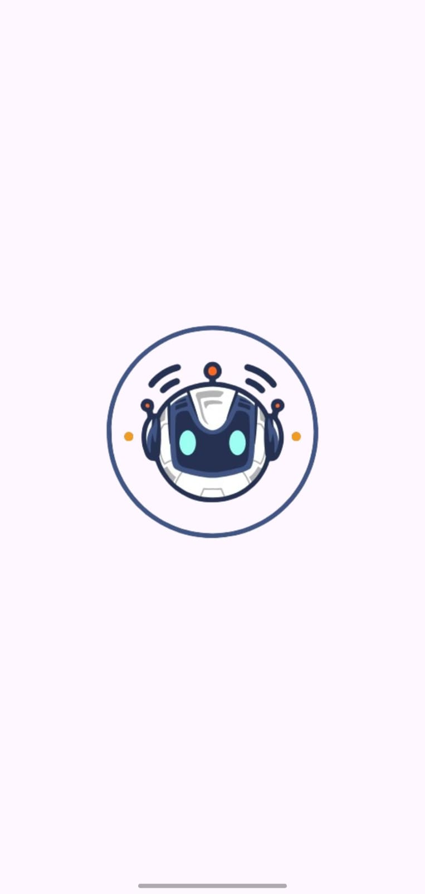
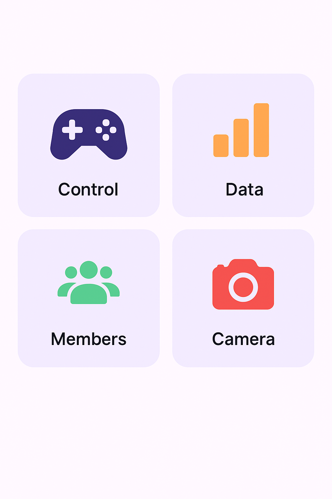
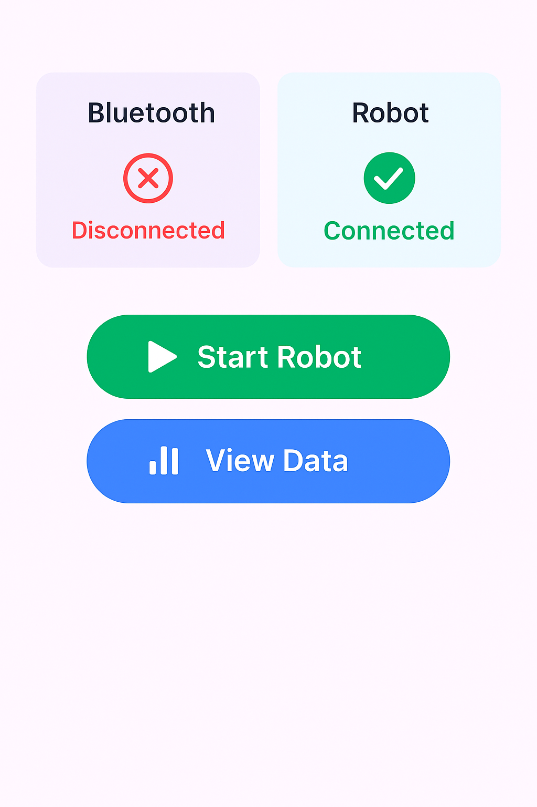
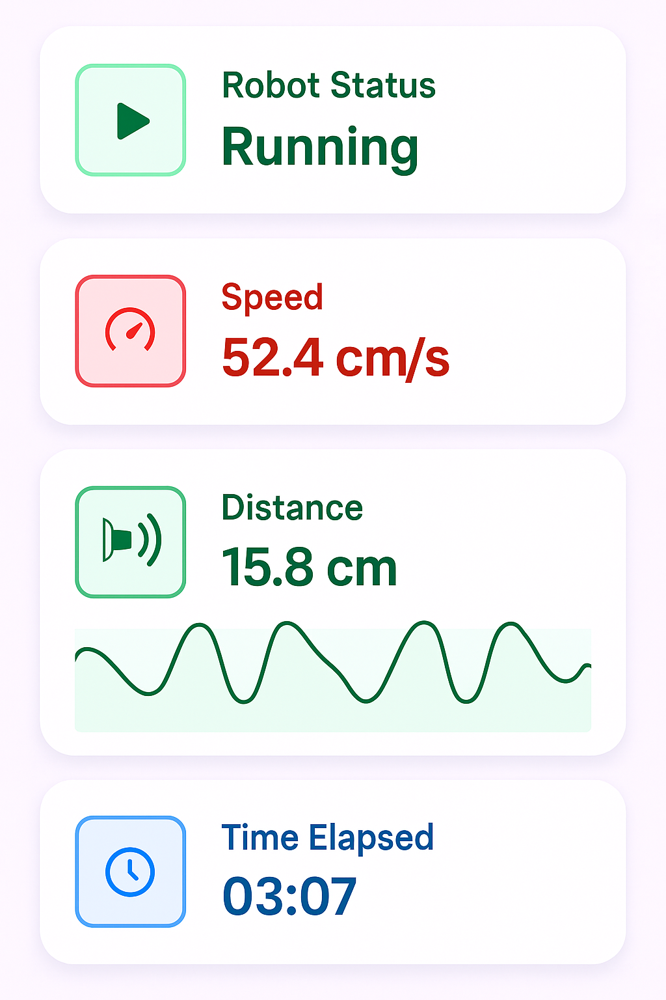

# 🛰️ Path Tracker – Flutter + Robotics

A Flutter-based application built to control and monitor a **path-tracking robot** used in a university robotics course project. The robot is designed to follow a path on the ground, avoid obstacles, and perform **reverse navigation**. This mobile app provides real-time data visualization and command control.

---

## 💡 Project Inspiration

This project originated from a **Robotics course assignment** where we had to build a robot capable of:
- Following a marked path
- Avoiding obstacles autonomously
- Reversing its path after reaching the destination

To complement the robot's hardware logic, we built a **Flutter app** to:
- Send commands to the robot (Start / Stop path tracking)
- Receive and visualize telemetry data (speed, distance from obstacle)
- Display data using interactive charts and clean UI elements

---

## 🎯 Key Features

- 📡 **Live Telemetry Monitoring**
  - View current **speed** and **distance from obstacles**
  - Graphical representation using dynamic charts

- 📲 **Command Center**
  - Start or stop path-following remotely
  - Send control signals to the robot over serial/Bluetooth/WiFi*

- 📊 **Data Visualization**
  - Line charts to show speed vs. time, distance vs. time
  - Live updates from the robot's sensors

- 🧩 **Modular Design**
  - Clean separation of logic using Cubit (BLoC)
  - Scalable for further robotics control (e.g., remote camera feed, GPS)

---

## 🧰 Tech Stack

- **Flutter (Dart)**
- **State Management:** Cubit / flutter_bloc
- **UI:** Responsive Flutter widgets, charts
- **Communication:** [Depends on your setup – Bluetooth, WiFi, or Serial]

---

## 🚀 Potential Use Cases

- Robotics Research Projects
- Educational Labs
- Remote Robot Control Systems
- IoT + Flutter Integration Experiments

---

## 📸 Screenshots

### 🚀 Splash Screen

### 🔌 Connect to Robot

### 🧭 Home Dashboard

### 🎮 Control Page

### 📊 Data Page

💬 **Open to feedback and collaboration!**
